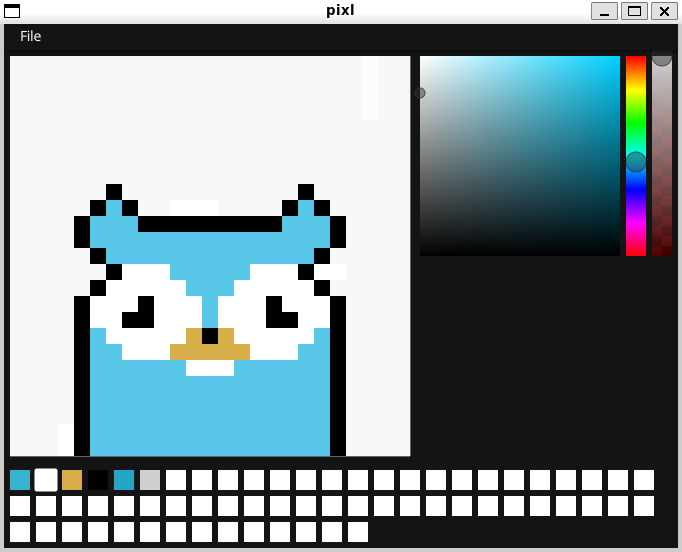

> A simple pixel art editor in Go

---

## Features

- Open and save png files
- Set dimensions of canvas
- Color selection via Color Picker
- Multiple swatches available
- Panning and zooming of canvas

---
<h2 style="text-align: center;"> How to Download and Install </h2>

## **1. Prerequisites**

Before you begin, ensure you have the following installed on your computer:

- **Go Programming Language** (version 1.18 or later). You can download it from [golang.org](https://golang.org/dl/).
- **Git** for cloning the repository. You can download it from [git-scm.com](https://git-scm.com/).

To verify that Go is installed, run the following command in your terminal:
```bash
go version

```
You should see the installed Go version (e.g., go version go1.22 linux/amd64).

## Pixl - A Pixel Art Editor in Go

### This guide will walk you through downloading, installing, and running the Pixl program on your local machine.

# --------------------------------------------
## **2. Clone the Repository**
# --------------------------------------------

## To download the source code, clone the repository to your local machine using Git:
system("git clone https://github.com/MSMITH71910/pixl.git")

## Navigate to the project directory:
```
Dir.chdir pixl
```
# --------------------------------------------
## **3. Install Dependencies**
# --------------------------------------------

## The program may use external Go packages. To ensure all dependencies are installed, run:
```bash
    go mod tidy
```
## This command will download and install any missing dependencies listed in the go.mod file.

# --------------------------------------------
## **4. Run the Program**
# --------------------------------------------

### To run the program, use the following command:
```
go run ./pixl/pixl.go
```

## This will start the Pixel Art Editor. A window should open, allowing you to create and edit pixel art.

# --------------------------------------------
## Building the Program
# --------------------------------------------

### If you want to build the program into an executable file, follow these steps:

## Step 1: Run the go build command:
```
go build -o pixl ./pixl/pixl.go
```

### This will create an executable file named `pixl` (or `pixl.exe` on Windows) in the current directory.

## Step 2: Run the executable:
```
./pixl
```

# --------------------------------------------
## Troubleshooting
# --------------------------------------------

## If you encounter any issues, here are some common solutions:

## **1. Missing Libraries on Linux:**
### **If you see an error like `cannot find -lXxf86vm`, install the required libraries:**
```
sudo apt update
```
```
sudo apt install libxxf86vm-dev libgl1-mesa-dev xorg-dev
```

## **2. Dependency Issues:**
### If dependencies are not installed correctly, run:
```
go mod tidy
```

## 3. Go Version Issues:
### **Ensure you are using Go 1.18 or later. Check your Go version with:**
```
go version
```

# --------------------------------------------
## License
# --------------------------------------------

### This project is licensed under the terms of the MIT license.
### For more details, refer to the LICENSE file in the repository.

## License

This project is licensed under the terms of the **MIT** license.
